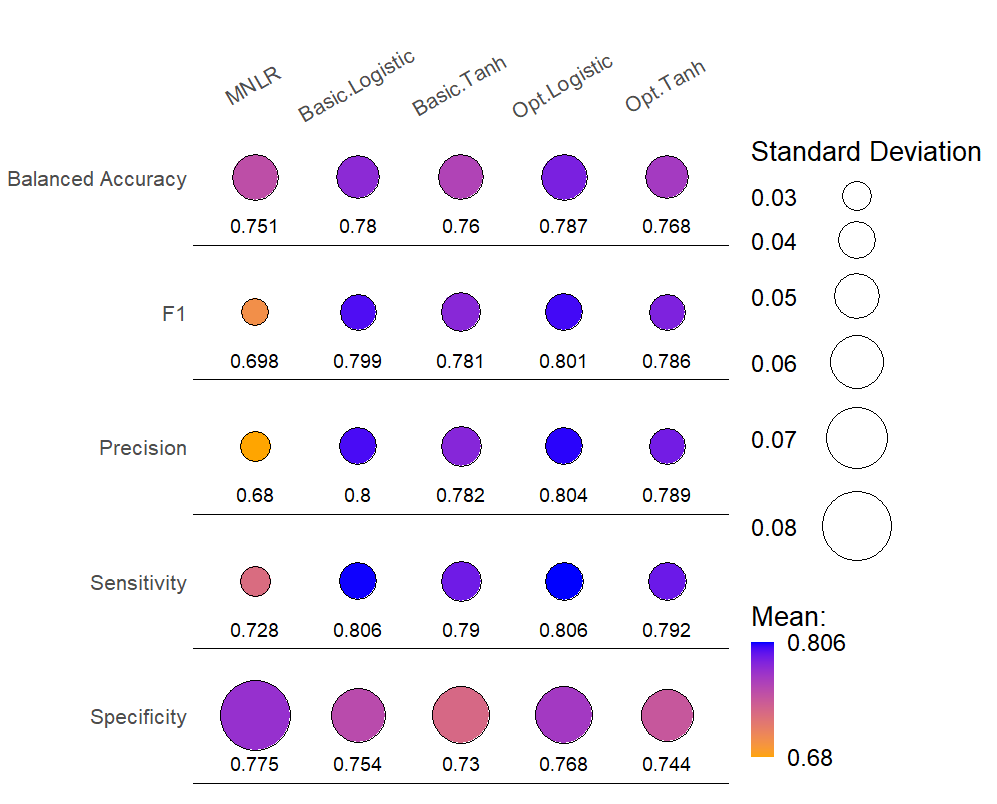

```{r setup, include=FALSE}
knitr::opts_chunk$set(echo = F, fig.pos = "H")
library(kableExtra)
```

# Abstract

*P. cinnamomi* is recognized internationally as a highly threatening phytopathogen and has been studied extensively, including in the Eastern Otway Ranges, Victoria.  Symptoms of its infection are resulting in massive changes to floral and faunal populations in the Otways. Disease mapping is an extremely useful tool in managing ecological pathogens, yet its application in this region and with this disease has yet to be fully investigated. This study explored if machine learning could improve disease map production efficiency and accuracy. This was done at the landscape-scale and therefore utilised remote sensed data. The viability of this process was demonstrated by the performance metrics of the final machine learned classifier. Environmental features which most improved disease presence prediction were identified, reported and evaluated for their reliability.

# Acknowledgements

Dustin Bridges aided with the acquisition of spatial data layers, His help is gratefully acknowledged.  Dr Scott Laidlaw (Deakin University), Adj. Assoc. Prof Barbara Wilson (Deakin University), Prof. David Cahill (Deakin University), Dr Mark Garkaklis (State of the Environment Pty Ltd) provided on-ground Phytophthora dieback assessments. Assessment was supported by Alec Garkaklis and Matt Ormerod.  


# Data & Code Accessibility

The link below references a GitHub repository. This repository contains:

*	Scripts used to generate results and figures
*	Dataframe containing 446 samples along with all predictors at those locations
*	.rda files containing reported metrics and plot-ready data

It is advised to consult the README.pdf first.

REPO: https://github.com/Max-Bladen/P.cinnamomi-ML-Mapping

\twocolumn

# Introduction

## *Prevalence of* P.cinnamomi

*Phytophthora cinnamomi* is an oomycete with far reaching and destructive capability. Its deleterious impacts have been identified around the globe (*Swiecki &; Bernhardt, 2003;* *Jung et al., 2018;* *Cahill et al., 2008*) as well as in most Australian states (*Wilson et al., 2012; McDougall et al., 2002; Scarlett et al., 2015; Bluett et al., 2003*). Its impacts are listed as of national environmental significance as a Key Threatening process under the Environmental Protection and Biodiversity Act, 1999 (*Australian Department of Agriculture, Water and Environment 1999; O’Gara et al., 2005*). A Threat Abatement Plan aims to recover threatened ecosystems and prevent further pathogen spread (*Australian Department of Environment and Energy, 2018*). 

## *Plant Susceptibility*

Up to 40% of Australian native plant species are susceptible to this phytopathogen (*Shearer et al., 2004*). Ecologically crucial genera such as *Xanthorrhoea* and *Banksia* are primary victims (*Wills, 1993*). It can use human and ecological vectors (e.g. bike tyres and small mammals) to transport its zoospores. Secondly, zoospores can produce mycelia which generate root-to-root contact between plants (*Cahill et al., 2008; Ristaino & Gumpertz, 2000*). Symptoms include wilting, decreased fruit size, gum exudation, necrosis, and leaf chlorosis (*CABI Invasive Species Compendium*). 

## *Ecological impacts of* P. cinnamomi

Vegetation floristics and structure are severely altered after the disease passes through an area. Low-level biodiversity suffers as a result (*Cahill et al., 2008; Barrett & Rathbone, 2018*). Proportions of bare and sedge-covered ground (Figure 1) increase (*Barrett & Rathbone, 2018; Laidlaw & Wilson, 2006; Hill et al., 2009*). Victorian studies saw reductions in *Ericaceae*, *Fabaceae*, *Myrtaceae* and *Proteaceae* densities (*Wills, 1993; Barett & Rathbone, 2018*). Faunal species such as *Antechinus. agilis*, *Rattus. fuscipes* and *R. lutreolus* also had significantly lower densities in post-infection areas (*Laidlaw & Wilson, 2006*). This is caused by reduced cover, nesting sites and increased predation.

```{r, out.width = '80%', fig.align='center', fig.cap="Sedges taking over a X. australis stump after it had been killed by P. cinnamomi. Key indicator of post-infection sites."}

```


## *Reflectance Data*

Sporadic work on producing time series maps of *P. cinnamomi* has shown promise (*Wilson et al., 2003*). Manual labour costs usually make generating disease maps prohibitively expensive (*O’Gara et al., 2005*). Remote sensing can be employed to circumvent this cost. Using aerial craft to measure spectral reflectance of a region exhibiting symptoms of *P. cinnamomi* has been successful (*Hill et al., 2009*). These reflectance values can form vegetative indices which have seen use as proxies for plant disease (*Sandmann et al., 2018*; *Zhang et al., 2003*). 

```{r, out.width = '100%', fig.align='center', fig.show="hold", fig.cap="Vegatation structure and floristic: (a) prior/during P. cinnamomi infection (N or A class) (b) after P. cinnamomi infection (P class)"}

knitr::include_graphics("Figures/P floristics.jpg")
```

## *Environmental Data*

Correlation analysis and stepwise logistic regression yielded altitude as a significant predictor of *P. cinnamomi* (*Wilson et al., 2003*). Lower altitude areas would gain more water via rainfall which would act as a vector and suitable environment for *P.cinnamomi* (*Shearer & Tippet, 1989*). 

Incline direction and angle, elevation and topographic position indices have all seen use in spatial predictors (*Wilson et al., 2003; Hill et al., 2009*). Potential Relative Radiation (PRR), has been shown to be a more accurate ecological index of disease status than Sun Index (*Pierce et al., 2005*).  

## *Ecological Machine Learning*

Machine learning (ML) involves a computer determining the optimal process to maximise the efficiency of a task. In this case, the task is classifying spatial points into one of three *P. cinnamomi* disease states.

ML is becoming more useful in developing predictive models on remote sensed data (*Maxwell et al., 2018; Holloway & Mengersen 2018; Kumar et al., 2020*). Phytopathologically, ML has primarily been used in agricultural studies at the organism scale (*Shruthi et al., 2020; Ramesh et al., 2018*). Rarely has it been employed for landscape-scale, ecological applications. 
 


# Methods

## *Study Area*

Two sites were investigated in the Otways Ranges near Anglesea (Figure 3). Sites 1 and 2 were clustered around the Bald Hills track and Denham Track respectively (Supplementary Figures 1 & 2). Three disease status classes were defined: post (P), active (A) and no infection (N). In that order, the density of lower level (0-1.5m) biomass increases, particularly *X. australis, I. cerataphyllus *and *B. marginata*. 


## *Data Utilised*

Remote-sensed, WGS84 projection data (Table 2) was sourced as .TIF files. Interpolation was used to homogenise resolutions to 10m and missing points were removed. From this, predictor values for the *n = 446* labelled data points were collected using latitudes and longitudes (Site 1: $n_{site.1} = 392$; Site 2: $n_{site.2} = 54$). 

Effective application of *DEM* and LANDSAT reflectances in previous study led to their usage here (*Wilson et al., 2003*; *Wilson et al., 2012*). *TIRS* and *SWIR* have seen success in phytopathogen detection, though not at a ecological-scale (*Lindenthal et al., 2005; Sandmann et al., 2018*). *TPI* potentially reads more detail in certain landscapes and was therefore explored (*Mokarram & Hojati, 2016*).

## *Feature Generation*

Latent components (Table 3) were constructed from the eleven predictors (Table 1). Firstly, the *aspect* and *slope* were derived from *DEM*. Using these, the *sun index *was calculated (1).

\begin{equation}
sun index = cos(aspect)* tan(slope)* 100
\end{equation}

The Hillshade function (2) can control for further topological parameters, including shading effects. From this, Potential Relative Radiation (*PRR*) can be determined. *PRR* is equivalent to seasonal average of HS (*Pierce et al., 2005*).

\begin{equation}
\begin{split}
HS = &255 * (((cos(zenith) * cos(slope))) \\
&\quad+(sin(zenith) * sin(slope) \\
&\qquad*cos(azimuth - aspect)))
\end{split}
\end{equation}

LANDSAT 8 uses digital numbers (DN) to represent reflectance. Different pairs of these can form varying normalised difference ratio images (3) – potential proxies for biotic stress. *PPR* reflects the average pigment concentration of plants whereas *NDVI* measures the density of plants – hence they are likely correlated. Similarly, WPR and PVR are also likely to be correlated.

\begin{equation}
NDRI = \frac{DN_1-DN_2}{DN_1+DN_2}
\end{equation}

By this point, the method had yielded a labelled data frame of 446 rows measured across 19 predictors (Table 2, Table 3). The outcome classes were highly imbalanced (Table 1).


## *Unsupervised Analysis*

Firstly, Pearson correlations between all predictor pairs were examined. Three clustering algorithms (k-means, PAM and hierarchical) were applied to the data and were evaluated via Mutual Information (MI) and the Adjusted Rand Index (ARI). PCA and PLS-DA were used to see if dimension reduction could aid in separating classes. Additionally, the Shapiro-Wilkes test (*Shapiro & Wilk, 1965*) was undergone on all features to determine their likelihood of normality. 


## *Supervised Analysis*

### *Association Analysis*

For all nineteen features (Table 2, Table 3):

*	Apply Kruskal-Wallis test (*Kruskal & Wallis, 1952*) which is a one way ANOVA of sample ranks. 
*	If significant test result, run Pairwise-Wilcoxon test to determine which pairs of classes have differing means.

```{r}
knitr::kable(readRDS("Tables/Class.Balance.rda"), 
             escape = FALSE,
             caption = "Class proportions.")
```

### *Model Building*

For all seven model types (Table 4):

*	Scale, and if model requires normalise, the input data.
*	Determine generally accepted hyperparameter (HP) default-values and tuning ranges.
*	Generate model(s) using base HPs via stratified 5-fold, 100-repeat cross validation (RCV). Referred to as “Basic”. Extract feature importance if applicable.
*	If tunable, optimize HP values (Appendix B). Using these HPs, generate optimized models utilising same RCV methodology. Referred to as “Optimised”. Extract feature importance if applicable.
*	Extract five key performance metrics (Appendix A) means and standard deviations of all generated models.

From this, the most accurate and precise model will be yielded. It will be trained on Site 1, tested on Site 2, and evaluated for its viability.


\onecolumn


```{r}
knitr::kable(readRDS("Tables/Feature.Desc.rda"), 
             escape = FALSE,
             caption = "Raw reflectance and topological features gathered for study. Res = resolution; Ref. = reflectance; USGS = United States Geological Survey; DEWLP = Department of Environment, Land, Water and Planning")
```

```{r}
knitr::kable(readRDS("Tables/Feature.Eng.Desc.rda"), 
             escape = FALSE,
             caption = "All engineered features, their derivation and a brief description.")
```

```{r fig.pos = "b", out.width = '100%', fig.align='center', fig.cap="Map of full study area. Site 1 is north west of the Anglsea mine while Site 2 is directly west. The legend depicts the classes of measured points. The pink boxes denote the depicted areas of Supplementary Figures 1 \\& 2."}

```

```{r}
knitr::kable(readRDS("Tables/Models.rda"), 
             escape = FALSE,
             caption = "All 29 models that were developed across the 7 employed algorithms. Describes whether each has tunable hyperparameters and whether the method yields importance measures for each input feature.")
```

\twocolumn

## *Supervised Analysis (cont.)*

### *Model Types (refer to Table 4)*

MNLR is the simplest model. It merely extends logistic regression to a multiclass problem. Features selected in more than 80% of models (stability > 80%) were used to generate another model. Lastly, LASSO regularisation was applied to form the final MNLR model.

NB relies on Bayes rule of posterior probability and can use both discrete and continuous data. “Gaussian” represents a model which assumes a normal distribution of continuous predictors whereas KDE builds the distribution from the data. Discretisation can aid in preventing overfitting. “Frequency” refers to bins of equal sample count whereas “interval” refers to bins of equal width. 

kNN doesn’t learn as much as just directly uses the training data – the k closest points are used to classify a novel sample. Three different distance measures were used by changing *p* (4). The Manhattan, Euclidean and Minkowski distances are yielded by using p = 1,2 and 3 respectively.

\begin{equation}
D(X, Y) = (\sum_{i=1}^{n} |x_i - y_i|^p)^{1/p}
\end{equation}

DT hierarchically partition the data via maximization of split criterion. Information Gain and the Gini Index were used as such criteria. RF extend DT by forming multiple trees which are each regularized – only a random subset of features is considered at each split. 

SVM form decision boundaries non-probabilistically. Additionally, it applies a kernel to the data, transforming it to a new space which may be more appropriate for class separation.

NN represents the frontier of machine learning, using series of computational neurons to facilitate deep learning. Neurons only fire if their input’s combine in an “activation function” to be above a threshold. Tanh and logistic functions were explored. 


# Results

## Unsupervised Analysis

Many expected relationships were confirmed, such as the correlations between *WPR*, *PVR* and *NDVI* (Figure 4, Figure 5). The similar patterns of *WPR* and *Aspect* despite their near-zero correlation was surprising, however. *Aspect* is likely related to *WPR* via rain and weather conditions in the region. Also unexpected was *TPI1000* ’s lack of clustering with *DEM* & *TPI100* but high clustering with thermal imaging features. The near perfect correlation between *Sun index* and *PRR* suggests the latter does not yield more information in this context. 

Dimension reduction and clustering were totally ineffective at separating classes (Supplementary Figures 3 & 4). 

All nineteen features received extremely significant ($\alpha = 0.05$) results from the Shapiro-Wilkes test, the maximum being *PVR* with 0.00531. Hence, all features were assumed to be distributed non-normally. 


```{r, out.width = '100%', fig.align='center', fig.cap="Heatmap depicting Pearson correlation of all pairs of 19 predictors. Note, order of features corresponds to complete hierarchical clustering (Figure 5)."}

```

```{r, out.width = '100%', fig.align='center', fig.cap="Dendrogram of complete hierarchical clustering tree on all predictors."}

```

\newpage
## Supervised Analysis

Fourteen of the nineteen predictors had significant results ($\alpha = 0.05$) from the Kruskal-Wallis test (Figure 6). In six of these fourteen features, all classes had differing means, six had two class pairs which differed and two only had one pair differ (Figure 7). 

```{r, out.width = '100%', fig.align='center', fig.cap="$log(p-value)$ from Kruskal-Wallis test applied on all predictors. Red dotted line shows $log(0.05)$, all predictors with $log(p-value)$ below red line had a significant result."}

```

```{r, out.width = '100%', fig.align='center', fig.cap="Results from Pairwise-Wilcoxon test. In a given cell, TRUE denotes if the Pairwise-Wilcoxon test determined that for that feature, the pair of classes had differing means. FALSE denotes otherwise."}

```

As the simplest model, MNLR had surprisingly good results. The basic form achieved the best metrics (Figure 8). The inability of the stable-features and regularized models to classify active samples led to their lower performance (Supplementary Figure 5). The models likely became too simple and underfit the data. The stabilities of *NIR* and *DEM* (Figure 9) align with previous findings - namely, the significance of *DEM* and *NDVI* (DN1=*NIR*). *Green* and *PVR* were much more stable than *Red* and *Blue* as well as their derivatives. The basic MNLR will be used as a baseline for other models.

```{r, out.width = '100%', fig.align='center', fig.cap="RCV results from each MNLR model. The number under each circle and the colour of the circle denote the mean of that metric, while the radius denotes the standard deviation of that metric."}

```

```{r, out.width = '100%', fig.align='center', fig.cap="Stabilities of each predictor averaged across all iterations of the basic MNLR model. Stability is the percentage of times a given feature was selected."}

```


Across all models and metrics, NB was worse than the baseline (Figure 10). Both discretisation methods had little impact. The KDE model achieved the best results and even had comparable Sens. to the baseline. NB’s inefficacy is likely a result of correlated features and the imbalanced classes. The former inflates the usefulness of unimportant features while the latter meant little was learnt about uninfected and active sites.

```{r, out.width = '90%', fig.align='center', fig.cap="RCV results from each NB model. The number under each circle and the colour of the circle denote the mean of that metric, while the radius denotes the standard deviation of that metric."}
knitr::include_graphics("Figures/NB Metrics/NB all metrics.png")
```

For all three distance measures, tuning yielded k=4 as the optimal number of clusters (Supplementary Figure 7). All models achieved results within 2% of one another, but each had higher means and comparable standard deviations to the baseline (Figure 11). kNN being non-parametric likely led to this improvement. Each distance was seemingly equivalent due to the similarity of results, though Minkowski did present as the best kNN model.

```{r, out.width = '90%', fig.align='center', fig.cap="RCV results from each kNN model. The number under each circle and the colour of the circle denote the mean of that metric, while the radius denotes the standard deviation of that metric."}
knitr::include_graphics("Figures/kNN Metrics/knn all metrics.png")
```

Optimised DT models only negligibly surpassed the performance of MNLR but had similar dispersions (Figure 12). A suspicion of overfitting was tested via a *post-hoc* test. The ranks of DT model BA and an overfitting measure (average difference between training and testing BA) were nearly equal (Table 5). This suggests the optimised gini index model had a reduced tendency to overfit. The ranking of feature importance to DT models was similar to MNLR stabilities (Figure 13). The discriminative ability of *NIR*, *DEM, Green, PVR *and *PPR* is further supported by this. Tuning the *minsplit* parameter ended up have no effect on performance (Supplementary Figure 9).

```{r, out.width = '90%', fig.align='center', fig.cap="RCV results from each DT model. The number under each circle and the colour of the circle denote the mean of that metric, while the radius denotes the standard deviation of that metric."}

```

```{r, out.width = '100%', fig.align='center', fig.cap="Importance of each predictor averaged across all iterations of the optimised Gini DT model. Unitless values. Originally summed to 100, were then scaled relative to the maximum importance value."}

```

```{r}
knitr::kable(readRDS("Tables/DT.overfitting.rda"), 
             escape = FALSE,
             caption = "Each DT model's Balanced Accuracy against the overfitting measure. The difference in training and testing accuracy was averaged across all folds and interations. Pearson correlation = 0.864.")
```

RF outperformed all prior models. Aggregating the predictions of all regularised trees led to reduced overfitting and greater generalisability. Despite the difference in HP values, the basic and optimised model made very similar predictions, resulting in similar performances (Figure 14). RF was notably better than DT in classifying A and N classes (Supplementary Figures 10 & 12). RF models performed well using *Sun Index* and *TPI1000* (Figure 15), incongruent with previous models. Note that the regularisation inflates feature importance compared to other methods. Near maximisation of both HPs suggests classifying requires controlling for combinatorial effects - more trees and features were needed to make accurate predictions (Supplementary Figure 11).

```{r, out.width = '100%', fig.align='center', fig.cap="RCV results from each RF model. The number under each circle and the colour of the circle denote the mean of that metric, while the radius denotes the standard deviation of that metric."}

```

```{r, out.width = '100%', fig.align='center', fig.cap="Importance of each predictor averaged across all iterations of the optimised RF model. Unitless values. Originally summed to 100, were then scaled relative to the maximum importance value."}

```

Only radial and polynomial SVM had desirable base models and were significantly improved by tuning. The *tolerance* HP only caused local perturbations in performance while *cost* was maximized (Supplementary Figure 13). Transformation to polynomial space performs well on normalised data, as was done for SVM. The linear kernel was unable to separate the classes, as was the sigmoid kernel (Figure 16).  The latter of which is surprising and suggests a lack of polarity between classes. This was supported by the total lack of separation seen in PCA and PLS-DA (Supplementary Figure 4).

```{r, out.width = '100%', fig.align='center', fig.cap="RCV results from each SVM model. The number under each circle and the colour of the circle denote the mean of that metric, while the radius denotes the standard deviation of that metric."}

```

The same was the case with the *threshold* HP for NN. Also, wider hidden layers were favoured by both models. The similarity of their tuning curves suggests activation function influenced prediction minimally (Supplementary Figure 15). Only negligible returns over MNLR were provided by NN (Figure 17), of which are considerably more expensive to produce. Also, this improvement in mean performance does not convey this model’s inability to positively identify the A class (Supplementary Figure 16). *DEM* and *NIR* were again key features in NN development, while the high ranking of *TIRS1* was surprising (Figure 18). 

```{r, out.width = '100%', fig.align='center', fig.cap="RCV results from each NN model. The number under each circle and the colour of the circle denote the mean of that metric, while the radius denotes the standard deviation of that metric."}

```

```{r, out.width = '100%', fig.align='center', fig.cap="Importance of each predictor averaged across all iterations of the optimised logistic NN model. Importance measured via the Olden measure, the averaged sum of all neuron weights associated with a given feature."}

```

## Final Model

The optimised RF model was selected as the final model due to its low dispersal across metrics and maximisation of BA (Figure 19). Its performance metrics (Table 6) are reduced compared development due to a lack of RCV and a more limited test set (54 samples). All three classes were classified moderately well, though the active class was predicted the worst (Figure 20).

```{r, out.width = '100%', fig.align='center', fig.cap="RCV results from the top performing model of each algorithmic type. The number under each circle and the colour of the circle denote the mean of that metric, while the radius denotes the standard deviation of that metric."}

```

```{r}
knitr::kable(t(readRDS("Tables/Final.Model.Metrics.rda")), 
             escape = FALSE,
             caption = "Metrics of final model. A, N and P denote class specific metrics. Average denotes the weighted (by class) average of each metric of the final model.")
```

```{r, out.width = '100%', fig.align='center', fig.cap="Samples predictions from site 2 projected geographically. Triangles represent a correct prediction of disease status. Circles denote incorrect predictions - inner colour = true class; outer colour = predicted class"}

```


# Discussion

The results of the final model are not game-changing. However, taking into acount the data and the preliminary nature of the study, nearly doubling BA compared to a random selection model is promising. Encouragingly, despite comprising only 8% of samples, active class metrics were comparable, if not better than the other two classes (Table 6). The limitations of the data and methodology (discussed below) means that currently, this model would only likely improve disease map cost marginally. With improvements (also discussed below), the method could become an effective abatement tool.

In line with *Wilson et al.* (*2003*), *DEM *was one of the most consistently used features across all models. Lower altitudes gain more water via rainfall, providing transport and moisture to zoospores. While *TPI1000* showed promise in RF and NN models, it is a derivative of *DEM* and hence is made somewhat redundant. *Aspect*, *slope* and *TPI100* seemingly suffered the same redundancy. *Sun index* ‘s lack of importance contrasts *Wilson et al.* (*2003*). Additionally, *PRR* was unable to improve upon it. *PRR* would likely find more use in a time-dependent model.

*PVR* and *Green* consistently ranked highly. While both seem to be valid proxies for biotic stress, it is unclear which is the optimal choice. *NIR* and *NDVI* had a similar relationship. This reflects the success of *NDVI* as a vegetation status index in previous study. Thermography and *SWIR* features did very little in the way of model improvement. Features worth further exploration include *DEM*, visible & *NIR* reflectance and their derivatives. *TPI*, *SWIR, TIRS* and topographic derivatives, such as *slope*, are likely worth omitting in future study. 

The lack of normality in the data contributed to parametric methods (such as gaussian NB and all MNLR) having lower-than-average performance. Moreover, the predictors were not independent and identically distributed (i.i.d.). SVM and RF would be less affected by this due to their built-in regularisation, but other methods would have been negatively impacted. The lack of i.i.d. features results in models learning spurious relationships rather than generalisable rules. Most importantly, samples were not independent. This problem is faced by all data analysis but is pronounced with spatial data. Adjacent, or even distant, cells can affect one another via numerous environmental mechanisms. The requirement of sample independence is ubiquitous across most classifiers. Hence, this is potentially the most important, and difficult, component to address in future study.

There were a few shortcomings in the experimental design. Most obviously, a small sample size and imbalanced classes hindered model development. More samples would be desirable. Without stratification when building folds, training sets were likely to not contain any active class samples. Model evaluation purity is somewhat compromised when data influences its own selection. given additional data, using random folds would be more appropriate. Some hyperparameters were of no use and others tuned to extreme values consistently. The latter suggests the range of tested values was too narrow.

Many concepts were abandoned during model building due to time constraints. LightGBM, a promising classifier akin to RF, was to be explored. This model has the potential to outperform all others but requires a lot of time-intensive tuning. 

Rainfall data was not available at an applicable resolution and was not used. Given all evidence for *DEM*‘s importance and its hypothesised mechanism, rainfall may be a very useful predictor. *P. cinnamomi* often utilises vehicles and boots along roads and tracks as vectors. Hence, it was hypothesised that proximity to different road types would influence infection likelihood. Data which depicted road locations in the study region were unable to be found. 

Models could utilise over-sampling of less abundant classes to create a balanced framework. Predicting the likelihood of infection (regression) rather than disease class (classification) would also be desirable. Ensemble learning was explored but yielded useless results. However, this does not mean it can’t improve a future model. Semi-supervised learning – that which combines supervised and unsupervised learning – presents a potential workaround for the minimal sample size. This last improvement would be the most useful. The cost of generating a labelled sample is quite large, yet there is an abundance of unlabelled points to use. 

In summary, this process and the model it yielded presents the first step into developing what could become an extremely useful tool in *P. cinnamomi* mapping and abatement. If expanded upon, it is conceivable to see it enhancing phosphite application efficiency, facilitating pre-emptive road and track closure and aiding in resouce allocation to different regions. Building these future models around the features identified (namely *DEM*, *Green*, *PVR*, *NIR* and *NDVI*) will be key to the success of such disease mapping.


\newpage 

# References

\begingroup
\fontfamily{ppl}\fontsize{8}{8}\selectfont


Australian Department of the Environment and Energy. (2018). Threat abatement plan for disease in natural ecosystems caused by Phytophthora cinnamomi. Retrieved from www.awe.gov.au/sites/default/files/documents/tap-phytophthora-cinnamomi-2018.pdfspeechlanguage/brochure_\newline preschool.aspx

Australia Department of Agriculture, Water and the Environment (1999). Environment Protection and Biodiversity Conservation Act. Retrieved from https://www.awe.gov.au/environment/epbc

Barrett, S., & Rathbone, D. (2018). Long-term phosphite application maintains species assemblages, richness and structure of plant communities invaded by Phytophthora cinnamomi. *Austral Ecology*, *43*(4), 360–374. https://doi.org/10.1111/aec.12574

Bluett, V., Weste, G., & Cahill, D. (2003). Distribution of disease caused by Phytophthora cinnamomi in Wilsons Promontory National Park and potential for further impact. *Australasian Plant Pathology*, *32*(4), 479. https://doi.org/10.1071/ap03048

Cahill, D. M., Rookes, J. E., Wilson, B. A., Gibson, L., & McDougall, K. L. (2008). Phytophthora cinnamomi and Australia’s biodiversity: impacts, predictions and progress towards control. *Australian Journal of Botany*, *56*(4), 279. https://doi.org/10.1071/bt07159

E O’Gara, K Howard, B Wilson and GEStJ Hardy (2005) Management of Phytophthora cinnamomi for Biodiversity Conservation in Australia: Part 2 ñ National Best Practice Guidelines. A report funded by the Commonwealth Government Department of the Environment and Heritage by the Centre for Phytophthora Science and Management, Murdoch University, Western Australia.

Hill, P. R., Kumar, A., Temimi, M., & Bull, D. R. (2020). HABNet: Machine Learning, Remote Sensing-Based Detection of Harmful Algal Blooms. *IEEE Journal of Selected Topics in Applied Earth Observations and Remote Sensing*, *13*, 3229–3239. https://doi.org/10.1109/jstars.2020.3001445

Hill, R. J., Wilson, B. A., Rookes, J. E., & Cahill, D. M. (2009). Use of high resolution digital multi-spectral imagery to assess the distribution of disease caused byPhytophthora cinnamomion heathland at Anglesea, Victoria. *Australasian Plant Pathology*, *38*(2), 110. https://doi.org/10.1071/ap08092

Holloway, J., & Mengersen, K. (2018). Statistical Machine Learning Methods and Remote Sensing for Sustainable Development Goals: A Review. *Remote Sensing*, *10*(9), 1365. https://doi.org/10.3390/rs10091365

Kruskal, W. H., & Wallis, W. A. (1952). Use of Ranks in One-Criterion Variance Analysis. *Journal of the American Statistical Association*, *47*(260), 583–621. https://doi.org/10.1080/01621459.1952.10483441

Laidlaw, W. S., & Wilson, B. A. (2006). Habitat utilisation by small mammals in a coastal heathland exhibiting symptoms of Phytophthora cinnamomi infestation. *Wildlife Research*, *33*(8), 639. https://doi.org/10.1071/wr05080

Lindenthal, M., Steiner, U., Dehne, H.-W. ., & Oerke, E.-C. . (2005). Effect of Downy Mildew Development on Transpiration of Cucumber Leaves Visualized by Digital Infrared Thermography. *Phytopathology®*, *95*(3), 233–240. https://doi.org/10.1094/phyto-95-0233

Maxwell, A. E., Warner, T. A., & Fang, F. (2018). Implementation of machine-learning classification in remote sensing: an applied review. *International Journal of Remote Sensing*, *39*(9), 2784–2817. https://doi.org/10.1080/01431161.2018.1433343

McDougall, K. L., Hardy, G. E. S. J., & Hobbs, R. J. (2002). Distribution of Phytophthora cinnamomi in the northern jarrah (Eucalyptus marginata) forest of Western Australia in relation to dieback age and topography. *Australian Journal of Botany*, *50*(1), 107. https://doi.org/10.1071/bt01040

Mokarram, M., & Hojati, M. (2016). Comparison of Landform Classifications of Elevation, Slope, Relief and Curvature with Topographic Position Index in the South of Bojnoord. *Ecopersia*, *4*(2), 1343–1357. https://doi.org/10.18869/modares.ecopersia.4.2.1343

Phytophthora cinnamomi (Phytophthora dieback). (2020). Retrieved from Cabi.org website: https://www.cabi.org/isc/datasheet/40957

Pierce, K. B., Lookingbill, T., & Urban, D. (2005). A simple method for estimating potential relative radiation (PRR) for landscape-scale vegetation analysis. *Landscape Ecology*, *20*(2), 137–147. https://doi.org/10.1007/s10980-004-1296-6

Ramesh, S., Hebbar, R., M., N., R., P., N., P. B., N., S., & P.V., V. (2018). Plant Disease Detection Using Machine Learning. *2018 International Conference on Design Innovations for 3Cs Compute Communicate Control (ICDI3C)*. https://doi.org/10.1109/icdi3c.2018.00017

Ristaino, J. B., & Gumpertz, M. L. (2000). New Frontiers in the Study of Dispersal and Spatial Analysis of Epidemics Caused by Species in the Genus *Phytophthora*. *Annual Review of Phytopathology*, *38*(1), 541–576. https://doi.org/10.1146/annurev.phyto.38.1.541

S, S. S., & B, W. M. (1965). An Analysis of Variance Test for Normality (Complete Samples). *Biometrika*, *52*(3/4), 591–611. https://doi.org/10.2307/2333709

Sandmann, M., Grosch, R., & Graefe, J. (2018). The Use of Features from Fluorescence, Thermography, and NDVI Imaging to Detect Biotic Stress in Lettuce. *Plant Disease*, *102*(6), 1101–1107. https://doi.org/10.1094/pdis-10-17-1536-re

Scarlett, K., Daniel, R., Shuttleworth, L. A., Roy, B., Bishop, T. F. A., & Guest, D. I. (2015). Phytophthora in the Gondwana Rainforests of Australia World Heritage Area. *Australasian Plant Pathology*, *44*(3), 335–348. https://doi.org/10.1007/s13313-015-0355-6

Shearer, B. L., Crane, C. E., & Cochrane, A. (2004). Quantification of the susceptibility of the native flora of the South-West Botanical Province, Western Australia, to Phytophthora cinnamomi. *Australian Journal of Botany*, *52*(4), 435. https://doi.org/10.1071/bt03131

Shearer, B. L., & Tippet, J. T. (1989). *Jarrah dieback : the dynamics and management of Phytophthora cinnamomi in the Jarrah (Eucalyptus marginata) forest of south-western Australia*. Australia: Department Of Western Australia.

Shruthi, U., Nagaveni, V., & Raghavendra, B. K. (2019, March 1). A Review on Machine Learning Classification Techniques for Plant Disease Detection. https://doi.org/10.1109/ICACCS.2019.8728415

WILLS, R. T. (1993). The ecological impact of Phytophthora cinnamomi in the Stirling Range National Park, Western Australia. *Austral Ecology*, *18*(2), 145–159. https://doi.org/10.1111/j.1442-9993.1993.tb00439.x

Wilson, B. A., Lewis, A., & Aberton, J. (2003). Spatial model for predicting the presence of cinnamon fungus (Phytophthora cinnamomi) in sclerophyll vegetation communities in south-eastern Australia. *Austral Ecology*, *28*(2), 108–115. https://doi.org/10.1046/j.1442-9993.2003.01253.x

Wilson, B. A., Zdunic, K., Kinloch, J., & Behn, G. (2012). Use of remote sensing to map occurrence and spread of Phytophthora cinnamomi in Banksia woodlands on the Gnangara Groundwater System, Western Australia. *Australian Journal of Botany*, *60*(6), 495. https://doi.org/10.1071/bt11305

Zhang, M., Qin, Z., Liu, X., & Ustin, S. L. (2003). Detection of stress in tomatoes induced by late blight disease in California, USA, using hyperspectral remote sensing. *International Journal of Applied Earth Observation and Geoinformation*, *4*(4), 295–310. https://doi.org/10.1016/s0303-2434(03)00008-4


\endgroup


\onecolumn
# Appendices

## Appendix A: Classification Metrics

\begin{equation}
Sensitivity (Sens.) = \frac{TP}{TP+FN}
\end{equation}

\begin{equation}
Specificity (Spec.) = \frac{TN}{TN+FP}
\end{equation}

\begin{equation}
Precision (Prec.) = \frac{TP}{TP+FP}
\end{equation}

\begin{equation}
F1 = \frac{2 * Precision * Sensitivity}{Precision+Sensitivity}
\end{equation}

\begin{equation}
Balanced Accuracy (BA) = \frac{Sensitivity+Specificity}{2}
\end{equation}


## Appendix B: Models & their Hyperparameters


```{r, fig.pos="t"}
knitr::kable(readRDS("Tables/Models.Appendix.rda"), 
             escape = FALSE,
             caption = "Model hyperparameter (HP) properties for this study. Includes a brief description of what each HP means, the default value used and the range of values tuning tested.")
```
