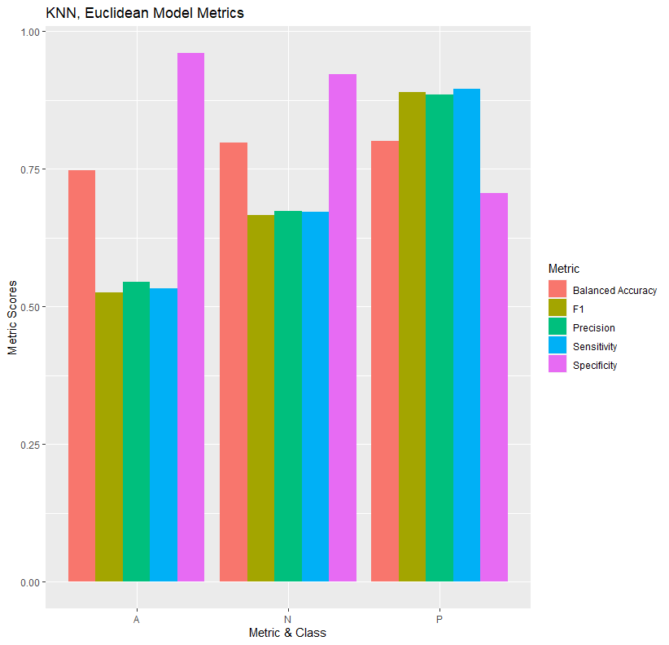
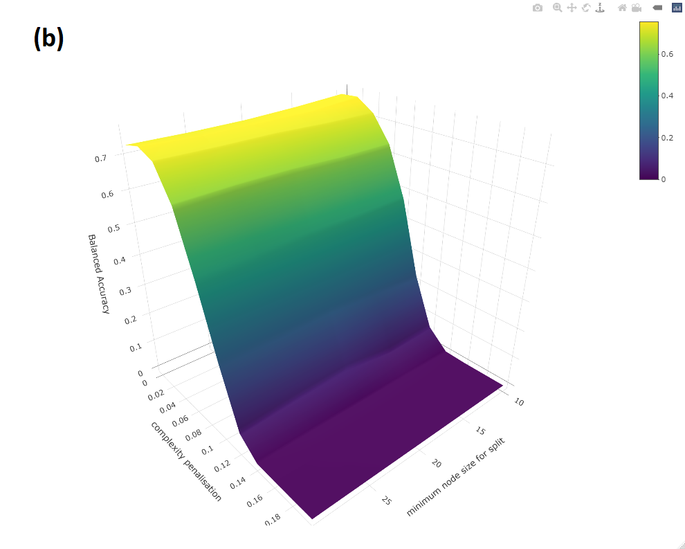
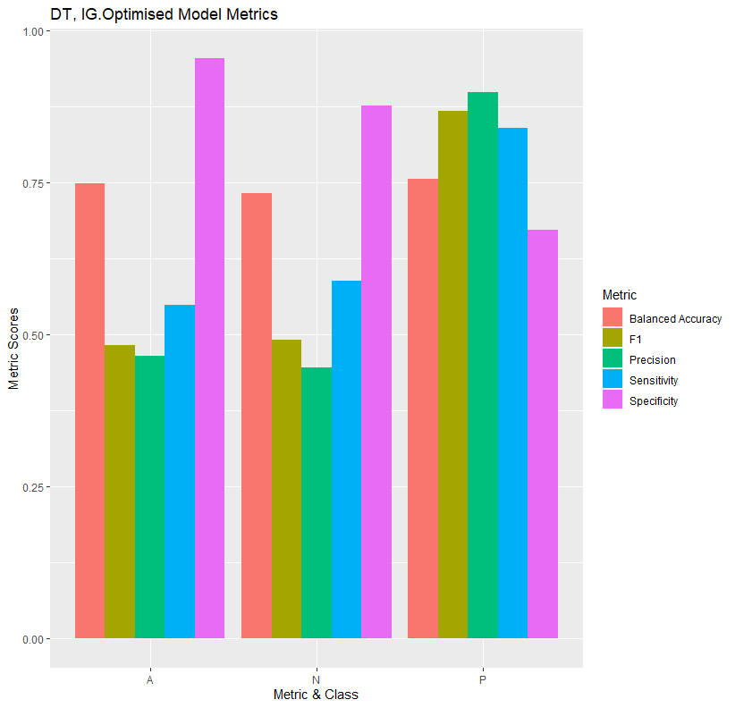

```{r setup, include=FALSE}
knitr::opts_chunk$set(echo = F)
```


\newpage


```{r out.width = '120%', fig.align='center', fig.cap="Map of Site 1. Same colouring scheme as Figure 3."}

```

```{r out.width = '120%', fig.align='center', fig.cap="Map of Site 2. Same colouring scheme as Figure 3."}

```

```{r, out.width = '49%', fig.align='center', fig.show="hold", fig.cap="Clustering evaluation before and after k tuning via (a) mutual information and (b) adjusted Rand Index. Tuning improved both metrics for k-means and hierarchical but worsened them for PAM. Colour of bar refers to pre- or post- tuning (refer to legend)."}

knitr::include_graphics("Figures/Clustering/Clustering ARI.png")
```


```{r, out.width = '49%', fig.align='center', fig.show="hold", fig.cap="Application of dimension reduction techniques (a) PCA and (b) PLSDA on the data. Colour of samples denotes class (refer to legend). Ellipses represent 95\\% confidence regions of the class centroid, hence their overlap means these techniques did not split classes well."}


```

```{r, out.width = '32%', fig.align='center', fig.show="hold", fig.cap="By class metrics of each model MNLR model built. Refer to figure title as to which model it is (Table 4)."}

knitr::include_graphics("Figures/MNLR Metrics/mnlr stbl metrics.png")

```

```{r, out.width = '49%', fig.align='center', fig.show="hold", fig.cap="By class metrics of each model NB model built. Refer to figure title as to which model it is (Table 4)."}


```

```{r, out.width = '32%', fig.align='center', fig.show="hold", fig.cap="Tuning of k for three distance measure kNN models. Note the scale of the y-axis. Optimal k selection derived from the maximisation of all metrics."}


```

```{r, out.width = '49%', fig.align='center', fig.show="hold", fig.cap="By class metrics of each model kNN model built. Refer to figure title as to which model it is (Table 4)."}


knitr::include_graphics("Figures/KNN Metrics/knn mhtn metrics.png")

```

```{r, out.width = '49%', fig.align='center', fig.show="hold", fig.cap="Tuning of cp and minsplit for (a) Gini Index and (b) Information Gain DT models. Note the scale of the z-axis. Optimal HP selection derived from the maximisation of BA."}


```

```{r, out.width = '49%', fig.align='center', fig.show="hold", fig.cap="By class metrics of each model DT model built. Refer to figure title as to which model it is (Table 4)."}



```

```{r, out.width = '80%', fig.align='center', fig.cap="Tuning of ntrees and mtry for RF model. Note the scale of the z-axis. Optimal HP selection derived from the maximisation of BA."}

```

```{r, out.width = '49%', fig.align='center', fig.show="hold", fig.cap="By class metrics of each model RF model built. Refer to figure title as to which model it is (Table 4)."}


```

```{r, out.width = '49%', fig.align='center', fig.show="hold", fig.cap="Tuning of tolerance and cost for (a) Linear, (b) Radial, (c) Polynomial and (d) Sigmoid kernel SVM models. Note the scale of the z-axis. Optimal HP selection derived from the maximisation of BA."}


```

```{r, out.width = '49%', fig.align='center', fig.show="hold", fig.cap="By class metrics of each model SVM model built. Refer to figure title as to which model it is (Table 4)."}

knitr::include_graphics("Figures/SVM Metrics/svm basic radial.png")


```

```{r, out.width = '49%', fig.align='center', fig.show="hold", fig.cap="Tuning of threshold and hidden for (a) Logistic and (b)Tanh NN models. Note the scale of the z-axis. Optimal HP selection derived from the maximisation of BA."}


```

```{r, out.width = '49%', fig.align='center', fig.show="hold", fig.cap="By class metrics of each model NN model built. Refer to figure title as to which model it is (Table 4)."}


```